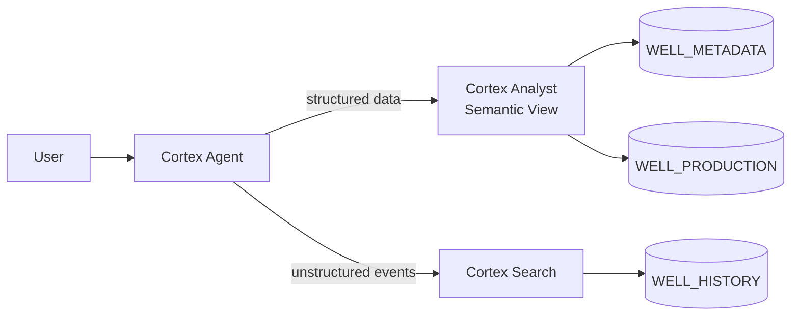
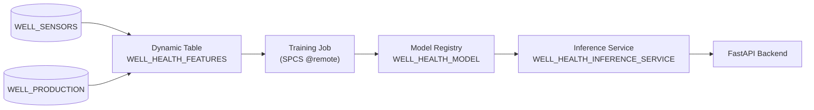

# Intelligent Well Assistant on Snowflake

> **This project is for demonstration purposes only.** 

AI-powered oil & gas well analytics combining a Cortex Agent (natural language chat), real-time well health scoring (ML), and interactive map visualizations — all running on Snowflake.

## Features

- **Well 360** — per-well deep-dive with health score, production history, ESP sensor data, events timeline, and inline AI chat
- **Production Insights** — natural language queries over production data (Cortex Analyst) and maintenance events (Cortex Search) with interactive Mapbox satellite map
- **Workflow Automation** — AI-powered Workover Report Agent that generates formal engineering documents from well data and operator inputs
- Real-time well health scores via Isolation Forest anomaly detection deployed as an SPCS inference service
- Sensitivity analysis (what-if scenarios) against the live model
- ESP sensor history visualization with zoom/pan
- Interactive Mapbox map with field/well filtering, area selection, and health-score color coding

## Architecture

### Cortex Agent Flow



### ML Pipeline



**Notebooks** (`notebooks/`):
1. Generate synthetic ESP sensor data
2. Create feature store (Dynamic Table joining sensors + production)
3. HPO training job via `@remote` on SPCS compute pool
4. Deploy inference service from Model Registry

## Data Model

| Table | Description |
|-------|-------------|
| `WELL_METADATA` | Well locations, operators, completions, status |
| `WELL_PRODUCTION` | Daily oil/gas/water production volumes |
| `WELL_HISTORY` | Operational events (indexed by Cortex Search) |
| `WELL_SENSORS` | ESP sensor readings at 6-hr intervals |
| `WELL_COMPLETIONS` | Frac completion stage data |
| `WELL_HEALTH_FEATURES` | Dynamic Table — real-time ML feature store |
| `FORECASTED_PRODUCTION` | 30-day decline curve forecasts |

## Tech Stack

- **Frontend**: React 18 + TypeScript + Vite + Tailwind CSS + Mapbox GL + Recharts
- **Backend**: FastAPI + snowflake-connector-python
- **AI**: Cortex Agent (claude-4-sonnet) + Cortex Analyst + Cortex Search
- **ML**: Snowflake Model Registry + Inference Service (Isolation Forest)
- **Deployment**: Snowpark Container Services (SPCS)

---

## Quick Start

### Prerequisites

- Snowflake account with Cortex features enabled
- Node.js 20+ / Python 3.11+ / uv
- Docker (for SPCS deployment)
- Mapbox API token

### Setup

```bash
# Python
python3 -m venv .venv && source .venv/bin/activate
uv sync

# Frontend
cd frontend && npm install && cd ..

# Environment
echo "VITE_MAPBOX_TOKEN=pk.your_token_here" > frontend/.env
```

### Run Locally

```bash
# Backend (set connection name to your Snowflake connection)
SNOWFLAKE_CONNECTION_NAME=your-connection uv run uvicorn backend.main:app --host 0.0.0.0 --port 8000 --reload

# Frontend (separate terminal)
cd frontend && npm run dev
```

Open http://localhost:5173

---

## Snowflake Setup

```bash
# Create agent + search service + semantic view
snow sql -f snowflake/setup.sql -c your-connection
snow sql -f snowflake/semantic_view.sql -c your-connection
snow sql -f snowflake/agent.sql -c your-connection
```

### ML Pipeline

Run notebooks in order:

```bash
cd notebooks
# 01 - Generate sensor data
# 02 - Create feature store (Dynamic Table)
# 03 - Train model (HPO on SPCS)
# 04 - Deploy inference service
```

---

## Deploy to SPCS

```bash
# Build and push
./build_push.sh

# Or manually
snow spcs image-registry login -c your-connection
docker build --platform linux/amd64 --build-arg VITE_MAPBOX_TOKEN="your_token" -t well-analytics-app:latest .
docker push <registry_url>/energy_demo/wells/well_app_repo/well-analytics-app:latest
```

Create service using `snowflake/service-spec.yaml` or see `snowflake/setup.sql`.

---

## Project Structure

```
snowflake-well-assistant/
├── backend/
│   ├── main.py                 # FastAPI endpoints
│   └── snowflake_client.py     # Cortex Agent streaming client
├── frontend/
│   └── src/
│       ├── components/
│       │   ├── Well360.tsx                # Per-well deep-dive view
│       │   ├── WorkflowAutomation.tsx     # Workover Report Agent
│       │   ├── ChatInterface.tsx          # Chat with markdown + streaming
│       │   ├── WellMap.tsx                # Mapbox satellite map
│       │   ├── WellHealthModal.tsx        # ESP sensor charts
│       │   ├── WellPredictModal.tsx       # Sensitivity analysis
│       │   └── WellClarificationModal.tsx
│       ├── api/wells.ts
│       └── types/index.ts
├── notebooks/
│   ├── 01_create_sensor_data.ipynb
│   ├── 02_feature_store.ipynb
│   ├── 03_training_job.ipynb
│   ├── 04_deploy_inference.ipynb
│   ├── snowpark_session.py      # Snowpark connection helper
│   └── utils.py
├── snowflake/
│   ├── setup.sql               # Infrastructure (tables, search, SPCS)
│   ├── semantic_view.sql       # Cortex Analyst semantic views
│   ├── semantic_model.yaml     # Cortex Analyst semantic model
│   ├── agent.sql               # Cortex Agent definition
│   ├── workover_agent_spec.json # Workover Report Agent config
│   └── service-spec.yaml       # SPCS container spec
├── scripts/
│   ├── generate_realistic_data.py  # Synthetic data (2,000 wells)
│   ├── upload_to_snowflake.py      # CSV → Snowflake loader
│   ├── train_health_model.py       # Isolation Forest training
│   └── train_well_forecast.py      # Decline curve forecasting
├── data/                           # Generated CSV datasets
├── Dockerfile
├── build_push.sh
└── pyproject.toml
```

---

## License

MIT
